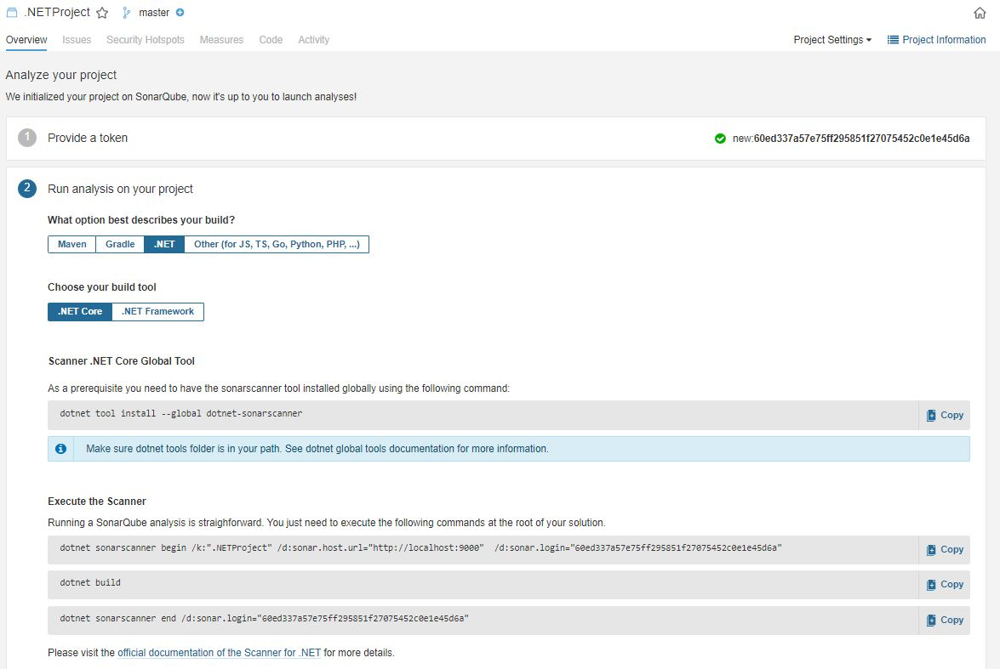
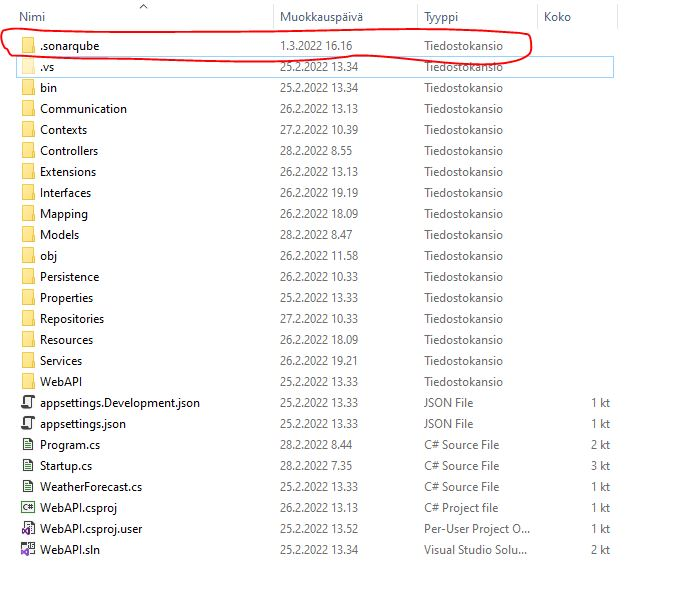
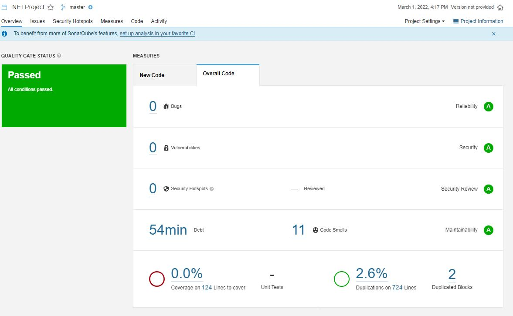

# sonarqube

## Käyttöohje

Lataa [sonarqube](https://www.sonarqube.org/downloads/) ilmainen Community-versio ja asenna se C:\sonarqube\-kansioon. 
Aja C:\sonarqube\bin\windows-x86-64>StartSonar.bat

avaa selaimessa localhost:9000

Luo uusi projekti "Create Project" 
Loppu vaiheessa kyselee skannattavan koodia ja tietokaneen käyttöjärjestelmää ja 
antaa kommennon, joka ajetaan skannattavan koodin juuressa. 

Lataa [sonar-scanner](https://docs.sonarqube.org/latest/analysis/scan/sonarscanner/) Windows 64-bit-versio ja 
asenna se C:\sonar-scanner\-kansioon.
A) JS-koodin skannaus
Menee skannattavan koodin juureen ja lisää sinne sonarqubesta saatu komentojono.

Kun skannaus on suoritettu onnistuneesti (INFO: EXECUTION SUCCESS), 
mene sonarqube-sivustolle (http://localhost:9000/) katsomaan tuloksia

B) C#-koodin skannaus
.NET-projektissa täytyy asentaa ensin dotnet-sonarscanner, jonka jälkeen 
varsinainen skannaus onnistuu

Skannaus lisää sonarqube-kansion koodiin.

Tulokset C#-projektista

